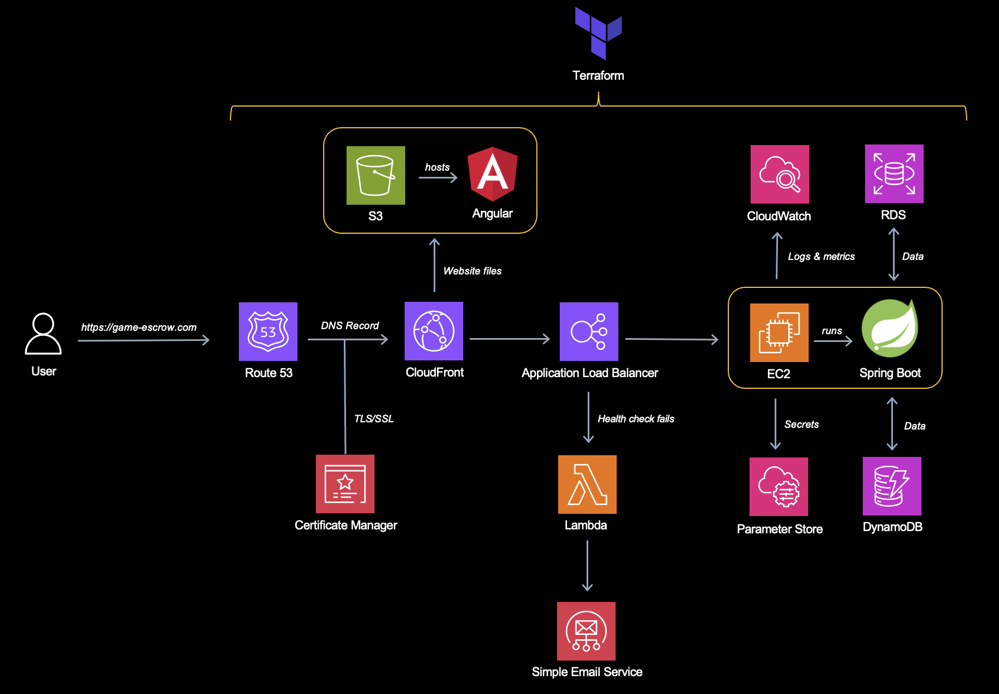

Game Escrow is a financial service that facilitates secure and transparent transactions involving digital game assets, such as 
 Maplestory equipment or account or 
 CS:GO cosmetic skins. Acting as a neutral third-party, the platform ensures the buyer's payment is held securely until the agreed-upon asset is delivered by the seller. Once the buyer confirms receipt, the payment is released to the seller, providing confidence and protection for both parties.

**Website:** [https://game-escrow.com](https://game-escrow.com)

## Architecture

## Technologies Used
### Frontend
- Angular 17
- HTML, CSS, TypeScript

### Backend
- Java 17
- Spring Boot: Spring MVC, Spring Security, Spring Data JPA, Spring WebSocket
- AWS SDK for Java 2.26

### Database
- AWS RDS
- AWS DynamoDB
- AWS S3

### Cloud
- AWS S3 (Frontend Hosting)
- AWS EC2 (Backend Hosting)
- AWS CloudFront
- AWS Lambda

### Deployment
- Terraform
- Github

## Features
1. **Escrow Management**: Securely holds payments until transaction conditions are met.
2. **User Authentication**: JWT-based authentication and authorization for secure user sessions.
3. **Real-time Updates**: Utilizes WebSocket for real-time transaction status updates.
5. **Scalability**: Deployed on a scalable AWS infrastructure for high availability, scalability and performance.